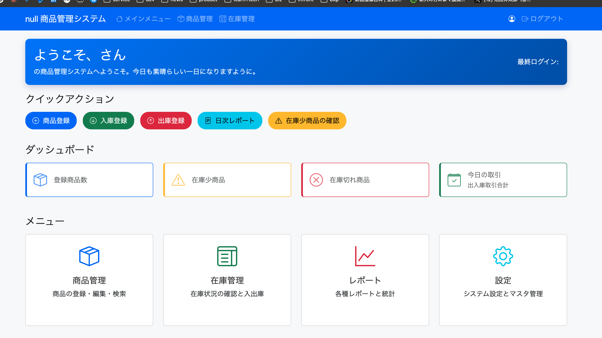

# バグ修正記録: Bug-01

## 問題概要
- **バグ内容**: 会社名が正しく表示されない問題
- **発生場所**: ナビゲーションバー（`http://localhost:8080/menu`）
- **症状**: `null 商品管理システム` と表示される



## 原因
1. `layout.html`のナビゲーションバーで会社名が静的にハードコードされていた
2. `/menu`エンドポイントを処理する`MenuController`で`companyName`属性がモデルに追加されていなかった

## 修正内容

### 1. layout.htmlの修正

**変更前**:
```html
<a class="navbar-brand" th:href="@{/}">商品管理システム</a>
```

**変更後**:
```html
<a class="navbar-brand" th:href="@{/}" th:text="${companyName} + ' 商品管理システム'">商品管理システム</a>
```

フッターも同様に修正:
```html
<p class="text-muted">&copy; 2025 <span th:text="${companyName}">商品管理システム</span></p>
```

### 2. GlobalModelAttributesAdviceの作成

すべてのコントローラで会社名を共通して利用できるように`GlobalModelAttributesAdvice`クラスを新規作成:

```java
package com.example.productmgr.config;

import com.example.productmgr.model.SystemSetting;
import com.example.productmgr.service.SystemSettingService;
import lombok.RequiredArgsConstructor;
import org.springframework.web.bind.annotation.ControllerAdvice;
import org.springframework.web.bind.annotation.ModelAttribute;

/**
 * すべてのコントローラーで共通のモデル属性を追加するためのControllerAdvice
 * これにより、すべてのビューで会社名などの共通情報が利用可能になる
 */
@ControllerAdvice
@RequiredArgsConstructor
public class GlobalModelAttributesAdvice {

    private final SystemSettingService systemSettingService;

    /**
     * 会社名をすべてのモデルに追加
     * 
     * @return システム設定から取得した会社名
     */
    @ModelAttribute("companyName")
    public String getCompanyName() {
        return systemSettingService.getString(SystemSetting.COMPANY_NAME, "株式会社サンプル");
    }
}
```

## 修正結果
- すべてのビューで会社名（株式会社サンプル）が正しく表示されるようになった
- `@ControllerAdvice`を使用することで、個別のコントローラで会社名を追加する必要がなくなった
- この実装により、システム設定で会社名を変更するとすべての画面に反映される

## 学んだこと
1. Spring MVCでは`@ControllerAdvice`を使用して、すべてのコントローラに共通の属性を追加できる
2. Thymeleafテンプレートでは`th:text`属性を使用して動的なコンテンツを表示できる
3. Dockerコンテナ内のアプリケーションを更新する場合は、コンテナをリビルドする必要がある
4. システム全体で共通して使用される設定値は一元管理し、すべてのビューで利用できるようにすることが重要

## 関連ファイル
- `/src/main/resources/templates/fragments/layout.html`
- `/src/main/java/com/example/productmgr/config/GlobalModelAttributesAdvice.java`
- `/src/main/java/com/example/productmgr/controller/MenuController.java`
- `/src/main/java/com/example/productmgr/service/SystemSettingService.java`
- `/src/main/java/com/example/productmgr/model/SystemSetting.java`