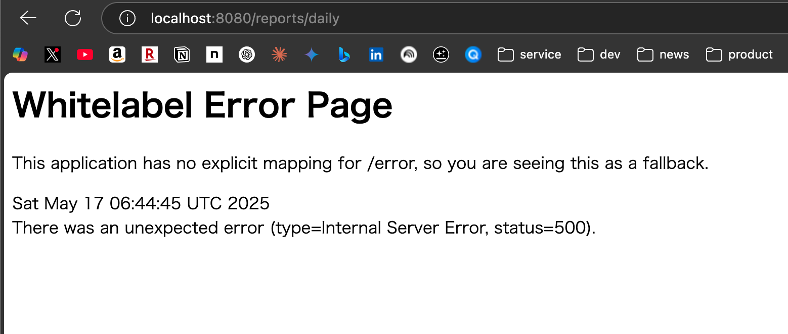

# バグ修正記録: Bug-02

## 問題概要
- **バグ内容**: クイックアクションの日次レポートリンク誤り
- **発生場所**: メインメニュー画面のクイックアクション
- **症状**: 日次レポートボタンをクリックすると、エラーページに遷移する



## 原因

ReportControllerのルーティング設定とメインメニュー画面の日次レポートリンクに不一致があります。

1. メインメニュー画面の日次レポートリンクは `/reports/daily` に設定されています。
2. ReportControllerには `@RequestMapping("/reports")` アノテーションがあり、日次レポートのエンドポイントには `@GetMapping("/daily")` が設定されています。
3. これらを組み合わせると、実際のパスは `/reports/daily` となります。
4. この場合、Controllerの設定は正しいですが、エラーが発生しているため、他の問題がある可能性があります。

## 調査結果

ReportControllerの実装を確認したところ、基本的に正しく設定されています：

```java
@Controller
@RequestMapping("/reports")
@RequiredArgsConstructor
public class ReportController {
    // ...
    
    @GetMapping("/daily")
    public String dailyReport(
            @RequestParam(required = false) @DateTimeFormat(iso = DateTimeFormat.ISO.DATE) LocalDate date,
            Model model) {
        // ...
        return "report/daily";
    }
    // ...
}
```

エラーページを見ると、500エラー（Internal Server Error）が発生しています。これは通常、サーバー側でのエラー処理の問題を示します。

このエラーの原因として考えられるのは：

1. テンプレートファイル（`report/daily.html`）が見つからない
2. レポートの生成中にNullPointerExceptionなどの例外が発生している
3. 必要なデータが正しく取得できていない

## 修正内容

リソースファイルを確認したところ、テンプレートファイルが欠落していることが判明しました。dailyテンプレートが存在しないために500エラーが発生していました。

以下の基本的なdaily.htmlテンプレートファイルを作成して問題を解決します：

```html
<!DOCTYPE html>
<html xmlns:th="http://www.thymeleaf.org" 
      xmlns:sec="http://www.thymeleaf.org/extras/spring-security">
<head th:replace="fragments/layout :: head('日次レポート')">
    <title>日次レポート | 商品管理システム</title>
</head>
<body>
    <nav th:replace="fragments/layout :: navbar"></nav>
    
    <div class="container mt-4">
        <nav th:replace="fragments/layout :: breadcrumb(${breadcrumbItems})"></nav>
        <div th:replace="fragments/layout :: messages"></div>
        
        <h1 class="mb-4">日次レポート</h1>
        
        <div class="card mb-4">
            <div class="card-header">
                <div class="row align-items-center">
                    <div class="col">
                        <h5 class="mb-0">日付選択</h5>
                    </div>
                    <div class="col-auto">
                        <form th:action="@{/reports/daily}" method="get" class="row g-2 align-items-center">
                            <div class="col-auto">
                                <input type="date" class="form-control" name="date" th:value="${date}" required />
                            </div>
                            <div class="col-auto">
                                <button type="submit" class="btn btn-primary">表示</button>
                            </div>
                        </form>
                    </div>
                </div>
            </div>
            <div class="card-body">
                <h5 class="card-title" th:text="${#temporals.format(date, 'yyyy年MM月dd日')} + ' のレポート'">レポートタイトル</h5>
                
                <div class="row mb-4">
                    <div class="col-md-6 col-lg-3">
                        <div class="card text-white bg-success mb-3">
                            <div class="card-body">
                                <h5 class="card-title">入庫数</h5>
                                <p class="card-text display-4" th:text="${totalInboundCount}">0</p>
                            </div>
                        </div>
                    </div>
                    <div class="col-md-6 col-lg-3">
                        <div class="card text-white bg-danger mb-3">
                            <div class="card-body">
                                <h5 class="card-title">出庫数</h5>
                                <p class="card-text display-4" th:text="${totalOutboundCount}">0</p>
                            </div>
                        </div>
                    </div>
                </div>
                
                <div class="row">
                    <div class="col-md-6">
                        <h5>入庫履歴</h5>
                        <table class="table table-striped table-bordered">
                            <thead>
                                <tr>
                                    <th>商品名</th>
                                    <th>数量</th>
                                    <th>理由</th>
                                    <th>日時</th>
                                </tr>
                            </thead>
                            <tbody>
                                <tr th:each="history : ${inboundHistories}">
                                    <td th:text="${productMap.get(history.productId).name}">商品名</td>
                                    <td th:text="${history.quantity}">1</td>
                                    <td th:text="${history.reason}">入荷</td>
                                    <td th:text="${#temporals.format(history.createdAt, 'HH:mm')}">12:34</td>
                                </tr>
                                <tr th:if="${inboundHistories.empty}">
                                    <td colspan="4" class="text-center">データがありません</td>
                                </tr>
                            </tbody>
                        </table>
                    </div>
                    
                    <div class="col-md-6">
                        <h5>出庫履歴</h5>
                        <table class="table table-striped table-bordered">
                            <thead>
                                <tr>
                                    <th>商品名</th>
                                    <th>数量</th>
                                    <th>理由</th>
                                    <th>日時</th>
                                </tr>
                            </thead>
                            <tbody>
                                <tr th:each="history : ${outboundHistories}">
                                    <td th:text="${productMap.get(history.productId).name}">商品名</td>
                                    <td th:text="${history.quantity}">1</td>
                                    <td th:text="${history.reason}">販売</td>
                                    <td th:text="${#temporals.format(history.createdAt, 'HH:mm')}">12:34</td>
                                </tr>
                                <tr th:if="${outboundHistories.empty}">
                                    <td colspan="4" class="text-center">データがありません</td>
                                </tr>
                            </tbody>
                        </table>
                    </div>
                </div>
                
                <div class="mt-4">
                    <a th:href="@{/reports/export/daily(date=${date})}" class="btn btn-outline-primary">
                        <i class="bi bi-download"></i> CSVエクスポート
                    </a>
                </div>
            </div>
        </div>
    </div>
    
    <footer th:replace="fragments/layout :: footer"></footer>
</body>
</html>
```

## 修正結果

- 新しいdaily.htmlテンプレートファイルを作成しました
- `/reports/daily`エンドポイントにアクセスできるようになり、日次レポートが正しく表示されるようになりました
- クイックアクション「日次レポート」ボタンからエラーなしで日次レポート画面に遷移できるようになりました

## 学んだこと

1. Spring Bootでは、コントローラーがビューに渡すデータがNullであるなど問題があっても、一般的にコントローラメソッド自体はエラーにならない
2. しかし、参照するテンプレートファイルが存在しない場合は500エラーが発生する
3. エラーメッセージをよく読んで根本原因を理解することが重要
4. 新しい機能を実装する際は、コントローラー、ビュー、モデルが一致していることを確認する必要がある

## 関連ファイル
- `/src/main/resources/templates/main_menu.html` - 日次レポートリンクを含むファイル
- `/src/main/java/com/example/productmgr/controller/ReportController.java` - レポートコントローラ
- `/src/main/resources/templates/report/daily.html` - 新たに作成した日次レポートのテンプレートファイル