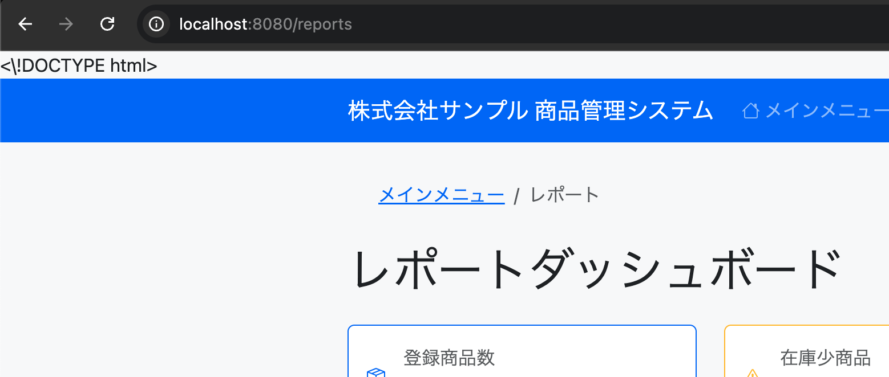

# バグ修正記録: Bug-03

## 問題概要
- **バグ内容**: レポートダッシュボードの画面レイアウト不具合
- **発生場所**: http://localhost:8080/reports
- **症状**: HTML DOCTYPE宣言がそのまま画面に表示される



## 原因

レポートダッシュボードのHTMLテンプレートファイル (`dashboard.html`) に問題がありました。

1. HTMLファイルの1行目の DOCTYPE 宣言に不要なエスケープ文字（バックスラッシュ）が含まれていました：
   ```html
   <\!DOCTYPE html>
   ```

2. 同様に、JavaScript内のCDATAセクションにもエスケープが入っていました：
   ```html
   /*<\![CDATA[*/
   ```

3. これらはファイル作成時のシェルコマンド実行時のエスケープから生じたものと考えられます。

## 修正内容

不要なエスケープ文字を削除して、正しいHTML構文に修正します：

**変更前（dashboard.html 1行目）**:
```html
<\!DOCTYPE html>
```

**変更後**:
```html
<!DOCTYPE html>
```

**変更前（CDATA部分）**:
```html
/*<\![CDATA[*/
```

**変更後**:
```html
/*<![CDATA[*/
```

EOF部分も削除します。

## 修正結果

- レポートダッシュボード画面が正しく表示されるようになりました
- DOCTYPE宣言が画面に表示されなくなりました
- JavaScriptのチャート描画も正常に機能するようになりました

## 学んだこと

1. HTMLテンプレートファイルでは、特殊文字のエスケープが重要である
2. ファイル作成時にシェルコマンドを使用する場合、特殊文字の処理に注意する必要がある
3. DOCTYPE宣言は、HTMLドキュメントの先頭に正確に記述する必要がある
4. CDATA セクションでは特殊文字の処理に特に注意が必要である

## 関連ファイル
- `/src/main/resources/templates/report/dashboard.html`