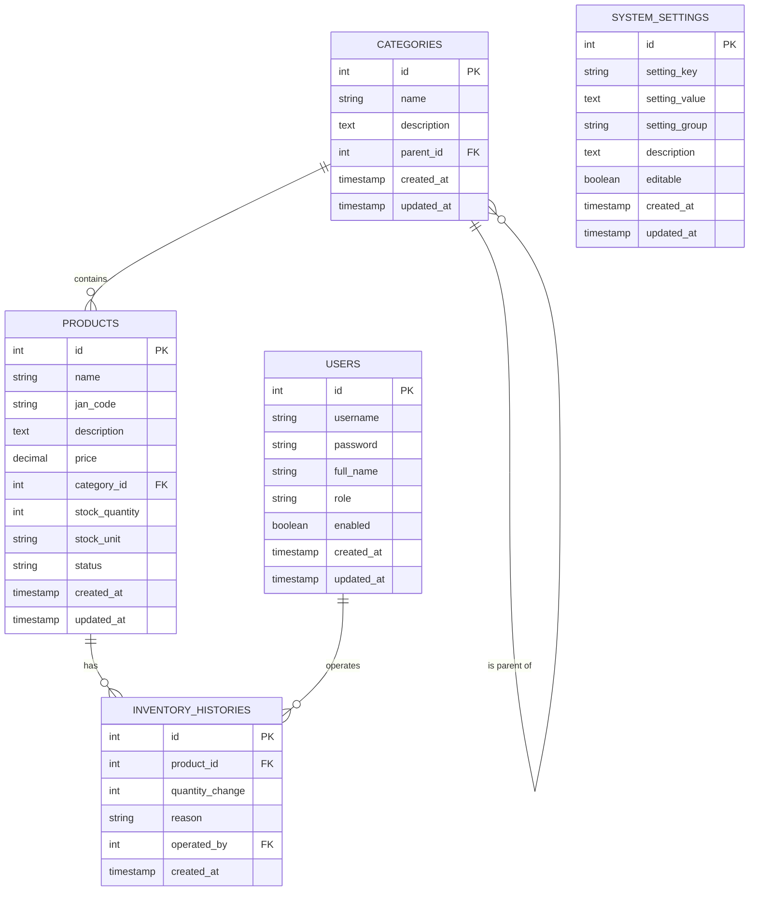
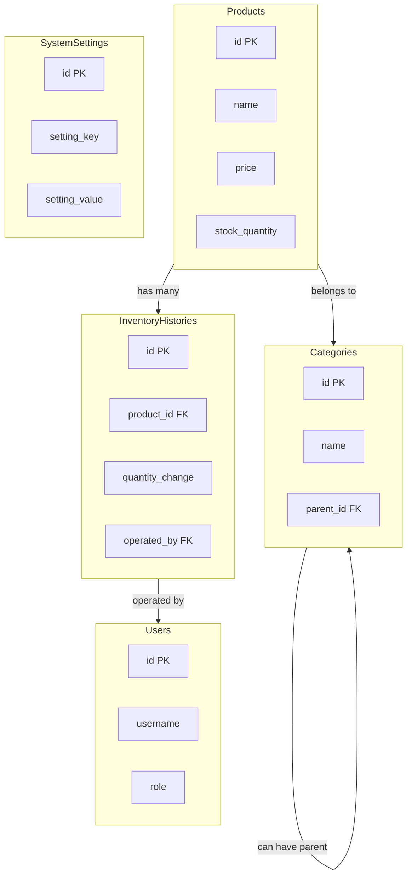

# 商品管理システム ER図

このドキュメントでは、商品管理システムのデータベースER図をMermaid記法で記述しています。

## ER図（Mermaid）

## テーブル関連図（詳細な関係性）

## 主要リレーション

1. **商品(PRODUCTS) - カテゴリ(CATEGORIES)**
   - 多対1の関係
   - 各商品は1つのカテゴリに所属する
   - 各カテゴリは複数の商品を持つことができる

2. **カテゴリ(CATEGORIES) - カテゴリ(CATEGORIES)**
   - 自己参照の多対1の関係
   - 各カテゴリは1つの親カテゴリを持つことができる（親カテゴリがない場合もある）
   - 各カテゴリは複数の子カテゴリを持つことができる

3. **商品(PRODUCTS) - 在庫履歴(INVENTORY_HISTORIES)**
   - 1対多の関係
   - 各商品は複数の在庫履歴を持つことができる
   - 各在庫履歴は1つの商品に関連付けられる

4. **ユーザー(USERS) - 在庫履歴(INVENTORY_HISTORIES)**
   - 1対多の関係
   - 各ユーザーは複数の在庫操作（在庫履歴の作成）を行うことができる
   - 各在庫履歴は1人のユーザーによって操作される

## テーブル概要

- **PRODUCTS**: 商品の基本情報と在庫情報を管理するマスタテーブル
- **CATEGORIES**: 商品カテゴリを管理するマスタテーブル
- **INVENTORY_HISTORIES**: 在庫の入出庫履歴を記録するテーブル
- **USERS**: システムのユーザー情報を管理するテーブル
- **SYSTEM_SETTINGS**: アプリケーション全体の設定を管理するテーブル

## 注記

- 在庫数量(stock_quantity)は products テーブルに直接保持される
- 在庫変更は inventory_histories テーブルに記録され、トリガーによって products テーブルの在庫数量が更新される
- カテゴリは階層構造を持ち、自己参照によって表現される