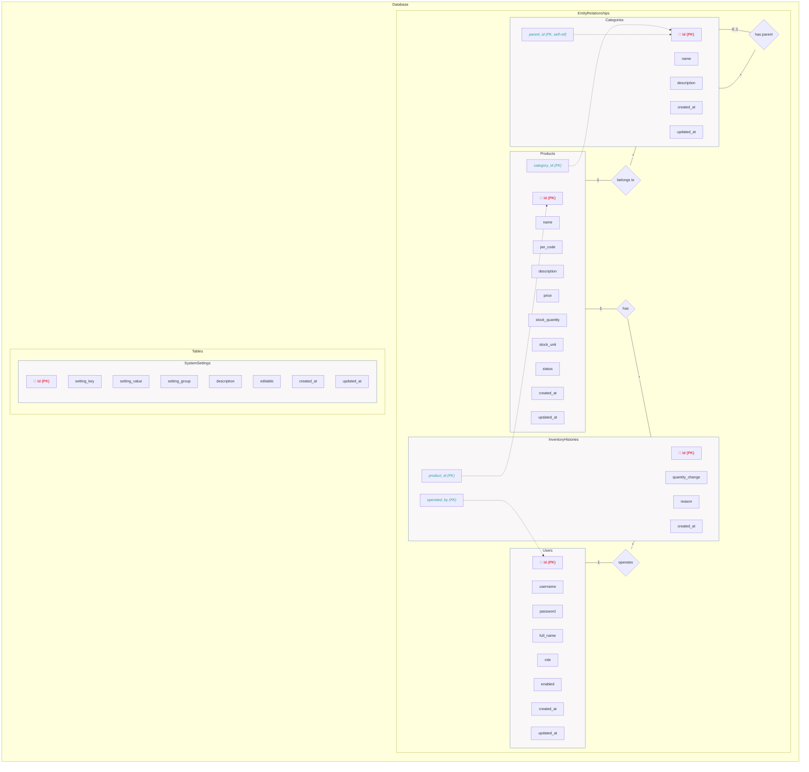
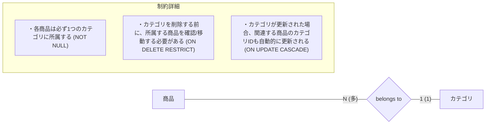
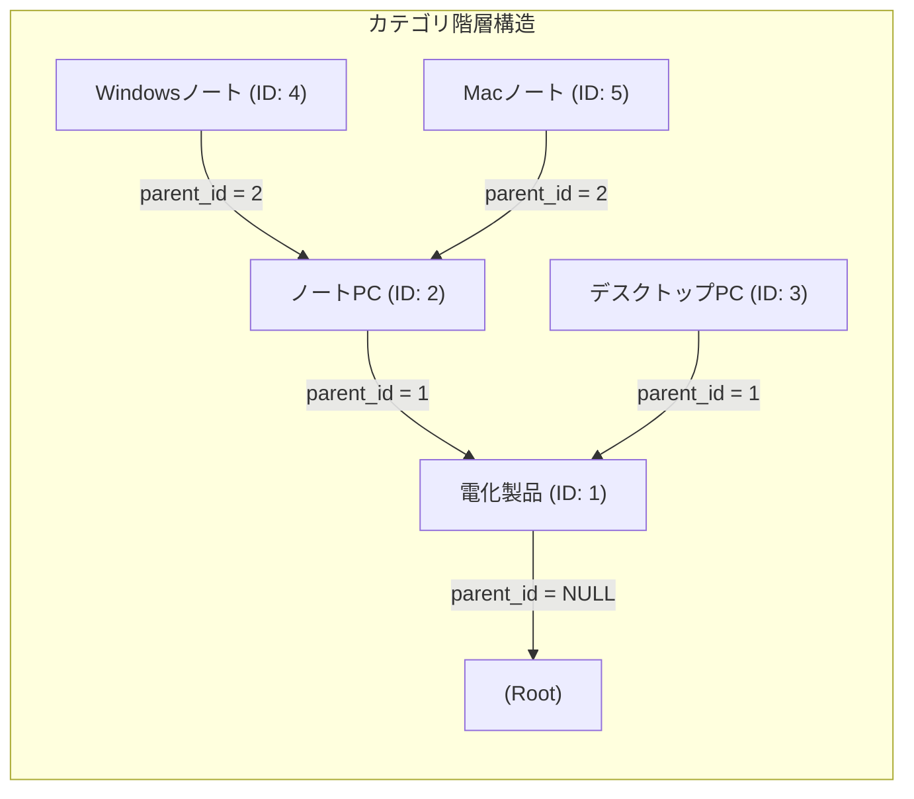
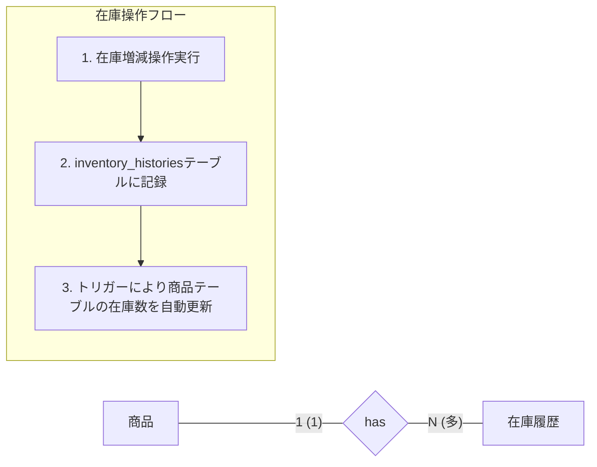
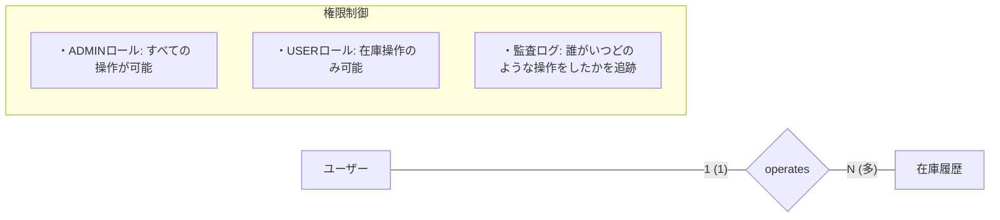
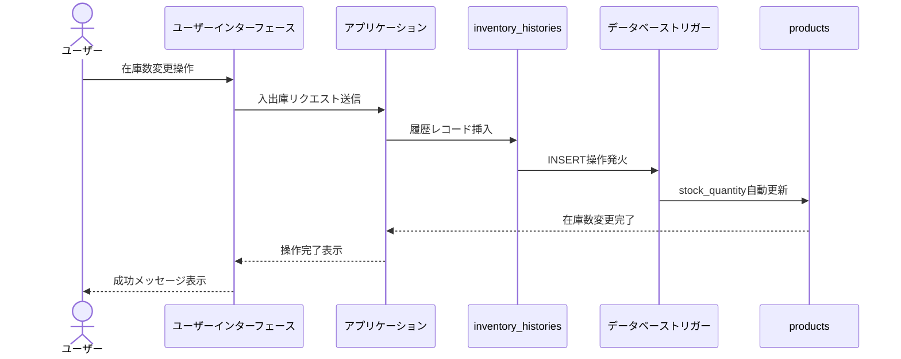

# 商品管理システム テーブル関連図

このドキュメントでは、商品管理システムのテーブル間の関連性をMermaid記法で記述しています。リレーションシップの詳細や制約についても記載しています。

## テーブル関連図

## リレーションシップ詳細

### 商品 ⟷ カテゴリ間のリレーション

### カテゴリの階層構造（自己参照）

### 商品 ⟷ 在庫履歴間のリレーション

### ユーザー ⟷ 在庫履歴間のリレーション

## トリガーによる自動処理

### 在庫更新トリガー

## データアクセスパターン

以下は、主要なデータアクセスパターンを示します：

1. **商品検索**: カテゴリID、商品名、JANコードによる絞り込み検索
2. **在庫管理**: 商品IDによる在庫の増減操作とその履歴表示
3. **カテゴリ管理**: 階層構造を持つカテゴリの追加、編集、表示
4. **ユーザー認証**: ユーザー名とパスワードによる認証
5. **システム設定**: キーと値のペアによる設定管理