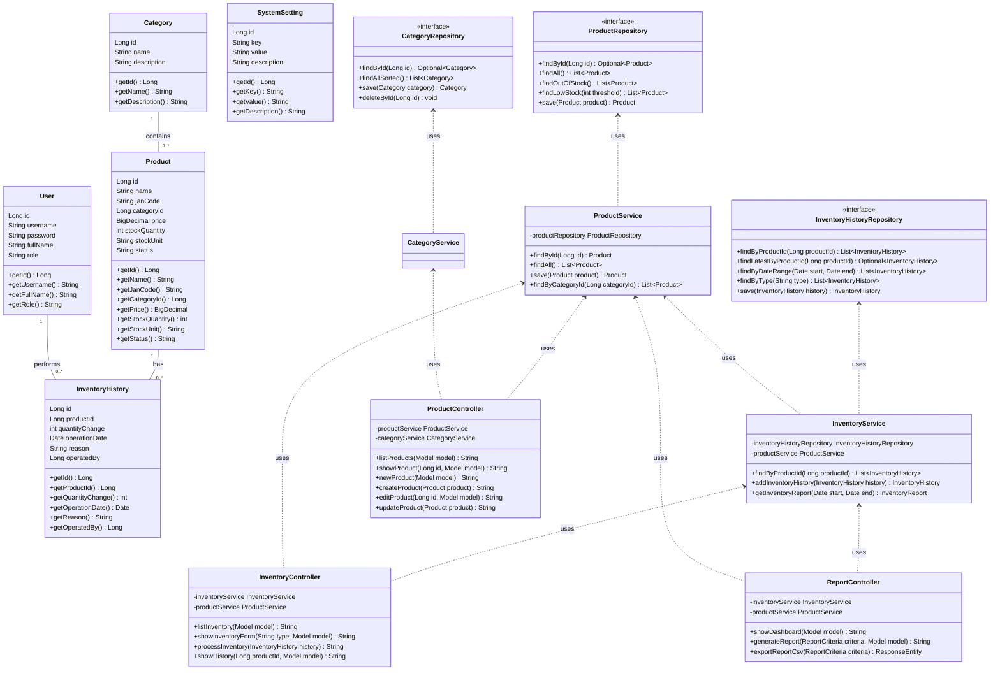

# Class Diagram

```mermaid
classDiagram
    %% Model Classes
    class Product {
        Long id
        String name
        String janCode
        Long categoryId
        BigDecimal price
        int stockQuantity
        String stockUnit
        String status
        +getId() Long
        +getName() String
        +getJanCode() String
        +getCategoryId() Long
        +getPrice() BigDecimal
        +getStockQuantity() int
        +getStockUnit() String
        +getStatus() String
    }
    
    class Category {
        Long id
        String name
        String description
        +getId() Long
        +getName() String
        +getDescription() String
    }
    
    class InventoryHistory {
        Long id
        Long productId
        int quantityChange
        Date operationDate
        String reason
        Long operatedBy
        +getId() Long
        +getProductId() Long
        +getQuantityChange() int
        +getOperationDate() Date
        +getReason() String
        +getOperatedBy() Long
    }
    
    class User {
        Long id
        String username
        String password
        String fullName
        String role
        +getId() Long
        +getUsername() String
        +getFullName() String
        +getRole() String
    }
    
    class SystemSetting {
        Long id
        String key
        String value
        String description
        +getId() Long
        +getKey() String
        +getValue() String
        +getDescription() String
    }
    
    %% Repository Interfaces
    class ProductRepository {
        <<interface>>
        +findById(Long id) Optional~Product~
        +findAll() List~Product~
        +findOutOfStock() List~Product~
        +findLowStock(int threshold) List~Product~
        +save(Product product) Product
    }
    
    class CategoryRepository {
        <<interface>>
        +findById(Long id) Optional~Category~
        +findAllSorted() List~Category~
        +save(Category category) Category
        +deleteById(Long id) void
    }
    
    class InventoryHistoryRepository {
        <<interface>>
        +findByProductId(Long productId) List~InventoryHistory~
        +findLatestByProductId(Long productId) Optional~InventoryHistory~
        +findByDateRange(Date start, Date end) List~InventoryHistory~
        +findByType(String type) List~InventoryHistory~
        +save(InventoryHistory history) InventoryHistory
    }
    
    %% Service Classes
    class ProductService {
        -productRepository ProductRepository
        +findById(Long id) Product
        +findAll() List~Product~
        +save(Product product) Product
        +findByCategoryId(Long categoryId) List~Product~
    }
    
    class InventoryService {
        -inventoryHistoryRepository InventoryHistoryRepository
        -productService ProductService
        +findByProductId(Long productId) List~InventoryHistory~
        +addInventoryHistory(InventoryHistory history) InventoryHistory
        +getInventoryReport(Date start, Date end) InventoryReport
    }
    
    %% Controller Classes
    class ProductController {
        -productService ProductService
        -categoryService CategoryService
        +listProducts(Model model) String
        +showProduct(Long id, Model model) String
        +newProduct(Model model) String
        +createProduct(Product product) String
        +editProduct(Long id, Model model) String
        +updateProduct(Product product) String
    }
    
    class InventoryController {
        -inventoryService InventoryService
        -productService ProductService
        +listInventory(Model model) String
        +showInventoryForm(String type, Model model) String
        +processInventory(InventoryHistory history) String
        +showHistory(Long productId, Model model) String
    }
    
    class ReportController {
        -inventoryService InventoryService
        -productService ProductService
        +showDashboard(Model model) String
        +generateReport(ReportCriteria criteria, Model model) String
        +exportReportCsv(ReportCriteria criteria) ResponseEntity
    }
    
    %% Relationships
    Category "1" -- "0..*" Product : contains
    Product "1" -- "0..*" InventoryHistory : has
    User "1" -- "0..*" InventoryHistory : performs
    
    ProductRepository <.. ProductService : uses
    CategoryRepository <.. CategoryService : uses
    InventoryHistoryRepository <.. InventoryService : uses
    
    ProductService <.. ProductController : uses
    CategoryService <.. ProductController : uses
    InventoryService <.. InventoryController : uses
    ProductService <.. InventoryController : uses
    InventoryService <.. ReportController : uses
    ProductService <.. ReportController : uses
    
    %% Additional relationship
    ProductService <.. InventoryService : uses
```