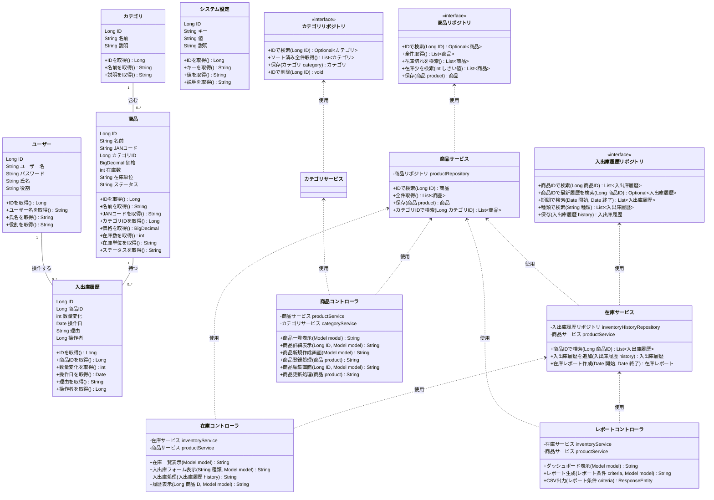

# クラス図 (日本語版)

```mermaid
classDiagram
    %% モデルクラス
    class 商品 {
        Long ID
        String 名前
        String JANコード
        Long カテゴリID
        BigDecimal 価格
        int 在庫数
        String 在庫単位
        String ステータス
        +IDを取得() Long
        +名前を取得() String
        +JANコードを取得() String
        +カテゴリIDを取得() Long
        +価格を取得() BigDecimal
        +在庫数を取得() int
        +在庫単位を取得() String
        +ステータスを取得() String
    }
    
    class カテゴリ {
        Long ID
        String 名前
        String 説明
        +IDを取得() Long
        +名前を取得() String
        +説明を取得() String
    }
    
    class 入出庫履歴 {
        Long ID
        Long 商品ID
        int 数量変化
        Date 操作日
        String 理由
        Long 操作者
        +IDを取得() Long
        +商品IDを取得() Long
        +数量変化を取得() int
        +操作日を取得() Date
        +理由を取得() String
        +操作者を取得() Long
    }
    
    class ユーザー {
        Long ID
        String ユーザー名
        String パスワード
        String 氏名
        String 役割
        +IDを取得() Long
        +ユーザー名を取得() String
        +氏名を取得() String
        +役割を取得() String
    }
    
    class システム設定 {
        Long ID
        String キー
        String 値
        String 説明
        +IDを取得() Long
        +キーを取得() String
        +値を取得() String
        +説明を取得() String
    }
    
    %% リポジトリインターフェース
    class 商品リポジトリ {
        <<interface>>
        +IDで検索(Long ID) Optional~商品~
        +全件取得() List~商品~
        +在庫切れを検索() List~商品~
        +在庫少を検索(int しきい値) List~商品~
        +保存(商品 product) 商品
    }
    
    class カテゴリリポジトリ {
        <<interface>>
        +IDで検索(Long ID) Optional~カテゴリ~
        +ソート済み全件取得() List~カテゴリ~
        +保存(カテゴリ category) カテゴリ
        +IDで削除(Long ID) void
    }
    
    class 入出庫履歴リポジトリ {
        <<interface>>
        +商品IDで検索(Long 商品ID) List~入出庫履歴~
        +商品IDで最新履歴を検索(Long 商品ID) Optional~入出庫履歴~
        +期間で検索(Date 開始, Date 終了) List~入出庫履歴~
        +種類で検索(String 種類) List~入出庫履歴~
        +保存(入出庫履歴 history) 入出庫履歴
    }
    
    %% サービスクラス
    class 商品サービス {
        -商品リポジトリ productRepository
        +IDで検索(Long ID) 商品
        +全件取得() List~商品~
        +保存(商品 product) 商品
        +カテゴリIDで検索(Long カテゴリID) List~商品~
    }
    
    class 在庫サービス {
        -入出庫履歴リポジトリ inventoryHistoryRepository
        -商品サービス productService
        +商品IDで検索(Long 商品ID) List~入出庫履歴~
        +入出庫履歴を追加(入出庫履歴 history) 入出庫履歴
        +在庫レポート作成(Date 開始, Date 終了) 在庫レポート
    }
    
    %% コントローラクラス
    class 商品コントローラ {
        -商品サービス productService
        -カテゴリサービス categoryService
        +商品一覧表示(Model model) String
        +商品詳細表示(Long ID, Model model) String
        +商品新規作成画面(Model model) String
        +商品登録処理(商品 product) String
        +商品編集画面(Long ID, Model model) String
        +商品更新処理(商品 product) String
    }
    
    class 在庫コントローラ {
        -在庫サービス inventoryService
        -商品サービス productService
        +在庫一覧表示(Model model) String
        +入出庫フォーム表示(String 種類, Model model) String
        +入出庫処理(入出庫履歴 history) String
        +履歴表示(Long 商品ID, Model model) String
    }
    
    class レポートコントローラ {
        -在庫サービス inventoryService
        -商品サービス productService
        +ダッシュボード表示(Model model) String
        +レポート生成(レポート条件 criteria, Model model) String
        +CSV出力(レポート条件 criteria) ResponseEntity
    }
    
    %% リレーションシップ
    カテゴリ "1" -- "0..*" 商品 : 含む
    商品 "1" -- "0..*" 入出庫履歴 : 持つ
    ユーザー "1" -- "0..*" 入出庫履歴 : 操作する
    
    商品リポジトリ <.. 商品サービス : 使用
    カテゴリリポジトリ <.. カテゴリサービス : 使用
    入出庫履歴リポジトリ <.. 在庫サービス : 使用
    
    商品サービス <.. 商品コントローラ : 使用
    カテゴリサービス <.. 商品コントローラ : 使用
    在庫サービス <.. 在庫コントローラ : 使用
    商品サービス <.. 在庫コントローラ : 使用
    在庫サービス <.. レポートコントローラ : 使用
    商品サービス <.. レポートコントローラ : 使用
    
    %% 追加関係
    商品サービス <.. 在庫サービス : 使用
```