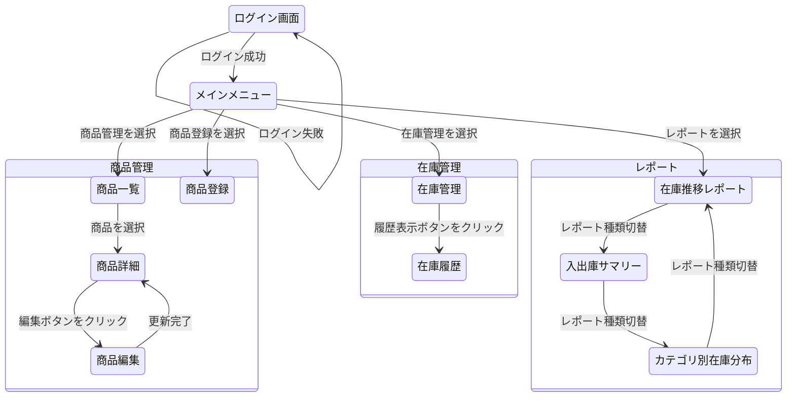

# 画面遷移図

```mermaid
stateDiagram-v2
    %% 画面定義
    state "ログイン画面" as Login
    state "メインメニュー" as MainMenu
    
    %% 商品関連画面
    state 商品管理 {
        state "商品一覧" as ProductList
        state "商品登録" as ProductCreate
        state "商品詳細" as ProductDetail
        state "商品編集" as ProductEdit
    }
    
    %% 在庫関連画面
    state 在庫管理 {
        state "在庫管理" as Inventory
        state "在庫履歴" as InventoryHistory
    }
    
    %% レポート関連画面
    state レポート {
        state "在庫推移レポート" as InventoryReport
        state "入出庫サマリー" as SummaryReport
        state "カテゴリ別在庫分布" as CategoryReport
    }
    
    %% 遷移定義
    Login --> Login : ログイン失敗
    Login --> MainMenu : ログイン成功
    
    MainMenu --> ProductList : 商品管理を選択
    MainMenu --> ProductCreate : 商品登録を選択
    MainMenu --> Inventory : 在庫管理を選択
    MainMenu --> InventoryReport : レポートを選択
    
    ProductList --> ProductDetail : 商品を選択
    ProductDetail --> ProductEdit : 編集ボタンをクリック
    ProductEdit --> ProductDetail : 更新完了
    
    Inventory --> InventoryHistory : 履歴表示ボタンをクリック
    
    InventoryReport --> SummaryReport : レポート種類切替
    SummaryReport --> CategoryReport : レポート種類切替
    CategoryReport --> InventoryReport : レポート種類切替
```