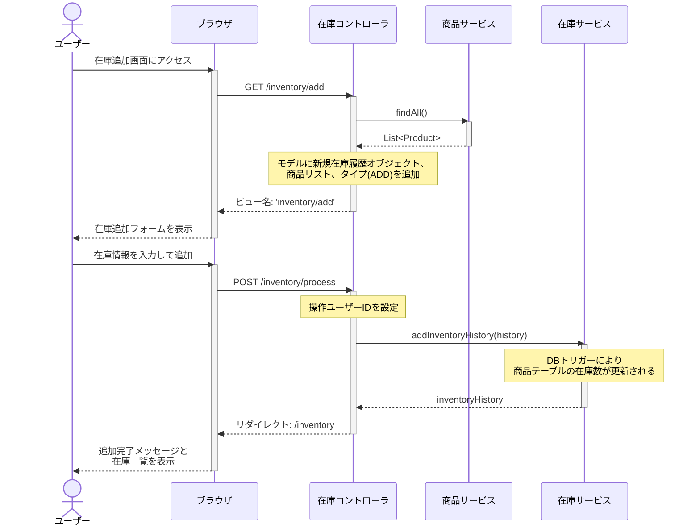

# 在庫追加のシーケンス図

```mermaid
sequenceDiagram
    actor User as ユーザー
    participant Browser as ブラウザ
    participant Controller as 在庫コントローラ
    participant ProductService as 商品サービス
    participant InventoryService as 在庫サービス
    
    %% 在庫追加フォーム表示
    User->>Browser: 在庫追加画面にアクセス
    activate Browser
    Browser->>Controller: GET /inventory/add
    activate Controller
    Controller->>ProductService: findAll()
    activate ProductService
    ProductService-->>Controller: List<Product>
    deactivate ProductService
    
    Note over Controller: モデルに新規在庫履歴オブジェクト、<br>商品リスト、タイプ(ADD)を追加
    Controller-->>Browser: ビュー名: 'inventory/add'
    deactivate Controller
    Browser-->>User: 在庫追加フォームを表示
    deactivate Browser
    
    %% 在庫追加処理
    User->>Browser: 在庫情報を入力して追加
    activate Browser
    Browser->>Controller: POST /inventory/process
    activate Controller
    
    Note over Controller: 操作ユーザーIDを設定
    
    Controller->>InventoryService: addInventoryHistory(history)
    activate InventoryService
    Note over InventoryService: DBトリガーにより<br>商品テーブルの在庫数が更新される
    InventoryService-->>Controller: inventoryHistory
    deactivate InventoryService
    
    Controller-->>Browser: リダイレクト: /inventory
    deactivate Controller
    Browser-->>User: 追加完了メッセージと<br>在庫一覧を表示
    deactivate Browser
```