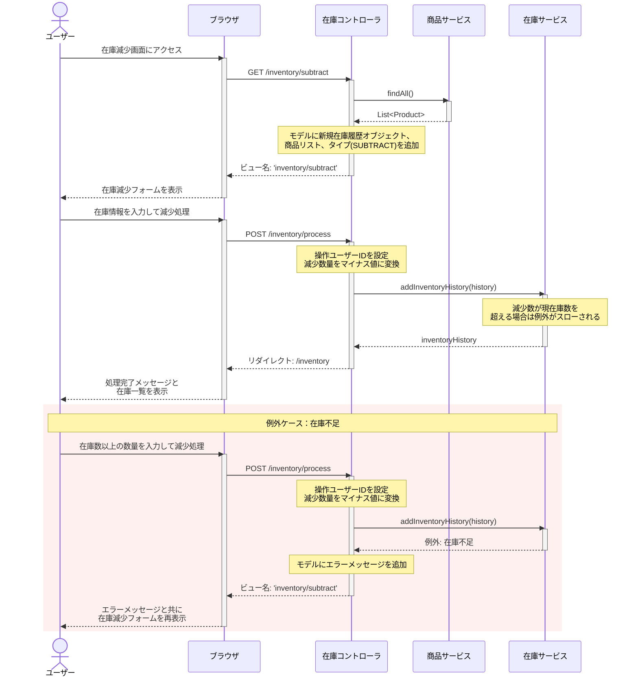

# 在庫減少のシーケンス図

```mermaid
sequenceDiagram
    actor User as ユーザー
    participant Browser as ブラウザ
    participant Controller as 在庫コントローラ
    participant ProductService as 商品サービス
    participant InventoryService as 在庫サービス
    
    %% 在庫減少フォーム表示
    User->>Browser: 在庫減少画面にアクセス
    activate Browser
    Browser->>Controller: GET /inventory/subtract
    activate Controller
    Controller->>ProductService: findAll()
    activate ProductService
    ProductService-->>Controller: List<Product>
    deactivate ProductService
    
    Note over Controller: モデルに新規在庫履歴オブジェクト、<br>商品リスト、タイプ(SUBTRACT)を追加
    Controller-->>Browser: ビュー名: 'inventory/subtract'
    deactivate Controller
    Browser-->>User: 在庫減少フォームを表示
    deactivate Browser
    
    %% 在庫減少処理
    User->>Browser: 在庫情報を入力して減少処理
    activate Browser
    Browser->>Controller: POST /inventory/process
    activate Controller
    
    Note over Controller: 操作ユーザーIDを設定<br>減少数量をマイナス値に変換
    
    Controller->>InventoryService: addInventoryHistory(history)
    activate InventoryService
    
    %% 正常ケース
    Note over InventoryService: 減少数が現在庫数を<br>超える場合は例外がスローされる
    InventoryService-->>Controller: inventoryHistory
    deactivate InventoryService
    
    Controller-->>Browser: リダイレクト: /inventory
    deactivate Controller
    Browser-->>User: 処理完了メッセージと<br>在庫一覧を表示
    deactivate Browser
    
    %% 例外ケース：在庫不足
    rect rgb(255, 240, 240)
    Note over User, InventoryService: 例外ケース：在庫不足
    
    User->>Browser: 在庫数以上の数量を入力して減少処理
    activate Browser
    Browser->>Controller: POST /inventory/process
    activate Controller
    
    Note over Controller: 操作ユーザーIDを設定<br>減少数量をマイナス値に変換
    
    Controller->>InventoryService: addInventoryHistory(history)
    activate InventoryService
    InventoryService-->>Controller: 例外: 在庫不足
    deactivate InventoryService
    
    Note over Controller: モデルにエラーメッセージを追加
    Controller-->>Browser: ビュー名: 'inventory/subtract'
    deactivate Controller
    Browser-->>User: エラーメッセージと共に<br>在庫減少フォームを再表示
    deactivate Browser
    end
```