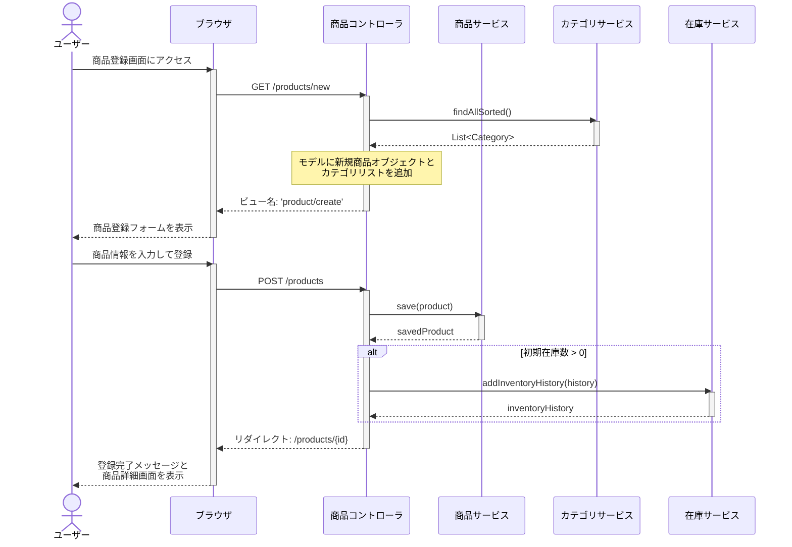

# 商品登録のシーケンス図

```mermaid
sequenceDiagram
    actor User as ユーザー
    participant Browser as ブラウザ
    participant Controller as 商品コントローラ
    participant ProductService as 商品サービス
    participant CategoryService as カテゴリサービス
    participant InventoryService as 在庫サービス
    
    User->>Browser: 商品登録画面にアクセス
    activate Browser
    Browser->>Controller: GET /products/new
    activate Controller
    Controller->>CategoryService: findAllSorted()
    activate CategoryService
    CategoryService-->>Controller: List<Category>
    deactivate CategoryService
    Note over Controller: モデルに新規商品オブジェクトと<br>カテゴリリストを追加
    Controller-->>Browser: ビュー名: 'product/create'
    deactivate Controller
    Browser-->>User: 商品登録フォームを表示
    deactivate Browser
    
    User->>Browser: 商品情報を入力して登録
    activate Browser
    Browser->>Controller: POST /products
    activate Controller
    Controller->>ProductService: save(product)
    activate ProductService
    ProductService-->>Controller: savedProduct
    deactivate ProductService
    
    alt 初期在庫数 > 0
        Controller->>InventoryService: addInventoryHistory(history)
        activate InventoryService
        InventoryService-->>Controller: inventoryHistory
        deactivate InventoryService
    end
    
    Controller-->>Browser: リダイレクト: /products/{id}
    deactivate Controller
    Browser-->>User: 登録完了メッセージと<br>商品詳細画面を表示
    deactivate Browser
```