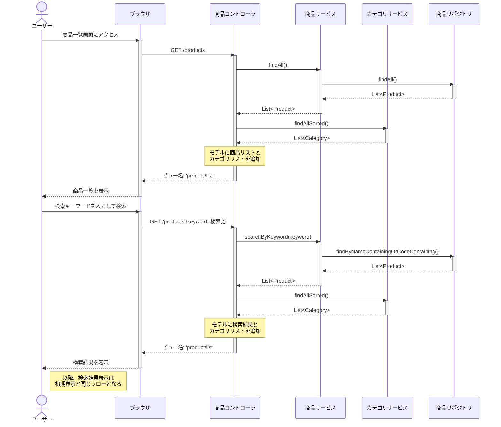

# 商品一覧表示のシーケンス図

```mermaid
sequenceDiagram
    actor User as ユーザー
    participant Browser as ブラウザ
    participant Controller as 商品コントローラ
    participant ProductService as 商品サービス
    participant CategoryService as カテゴリサービス
    participant Repository as 商品リポジトリ
    
    %% 初期商品一覧表示
    User->>Browser: 商品一覧画面にアクセス
    activate Browser
    Browser->>Controller: GET /products
    activate Controller
    Controller->>ProductService: findAll()
    activate ProductService
    ProductService->>Repository: findAll()
    activate Repository
    Repository-->>ProductService: List<Product>
    deactivate Repository
    ProductService-->>Controller: List<Product>
    deactivate ProductService
    
    Controller->>CategoryService: findAllSorted()
    activate CategoryService
    CategoryService-->>Controller: List<Category>
    deactivate CategoryService
    
    Note over Controller: モデルに商品リストと<br>カテゴリリストを追加
    Controller-->>Browser: ビュー名: 'product/list'
    deactivate Controller
    Browser-->>User: 商品一覧を表示
    deactivate Browser
    
    %% 検索操作
    User->>Browser: 検索キーワードを入力して検索
    activate Browser
    Browser->>Controller: GET /products?keyword=検索語
    activate Controller
    Controller->>ProductService: searchByKeyword(keyword)
    activate ProductService
    ProductService->>Repository: findByNameContainingOrCodeContaining()
    activate Repository
    Repository-->>ProductService: List<Product>
    deactivate Repository
    ProductService-->>Controller: List<Product>
    deactivate ProductService
    
    Controller->>CategoryService: findAllSorted()
    activate CategoryService
    CategoryService-->>Controller: List<Category>
    deactivate CategoryService
    
    Note over Controller: モデルに検索結果と<br>カテゴリリストを追加
    Controller-->>Browser: ビュー名: 'product/list'
    deactivate Controller
    Browser-->>User: 検索結果を表示
    deactivate Browser
    
    Note right of User: 以降、検索結果表示は<br>初期表示と同じフローとなる
```