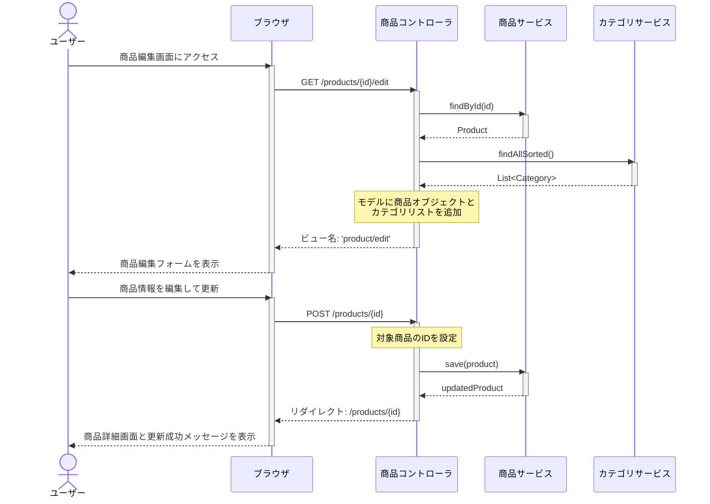

# 商品更新のシーケンス図

```mermaid
sequenceDiagram
    actor User as ユーザー
    participant Browser as ブラウザ
    participant Controller as 商品コントローラ
    participant ProductService as 商品サービス
    participant CategoryService as カテゴリサービス
    
    %% 編集フォーム表示
    User->>Browser: 商品編集画面にアクセス
    activate Browser
    Browser->>Controller: GET /products/{id}/edit
    activate Controller
    Controller->>ProductService: findById(id)
    activate ProductService
    ProductService-->>Controller: Product
    deactivate ProductService
    
    Controller->>CategoryService: findAllSorted()
    activate CategoryService
    CategoryService-->>Controller: List<Category>
    deactivate CategoryService
    
    Note over Controller: モデルに商品オブジェクトと<br>カテゴリリストを追加
    Controller-->>Browser: ビュー名: 'product/edit'
    deactivate Controller
    Browser-->>User: 商品編集フォームを表示
    deactivate Browser
    
    %% 更新処理
    User->>Browser: 商品情報を編集して更新
    activate Browser
    Browser->>Controller: POST /products/{id}
    activate Controller
    
    Note over Controller: 対象商品のIDを設定
    
    Controller->>ProductService: save(product)
    activate ProductService
    ProductService-->>Controller: updatedProduct
    deactivate ProductService
    
    Controller-->>Browser: リダイレクト: /products/{id}
    deactivate Controller
    Browser-->>User: 商品詳細画面と更新成功メッセージを表示
    deactivate Browser
```